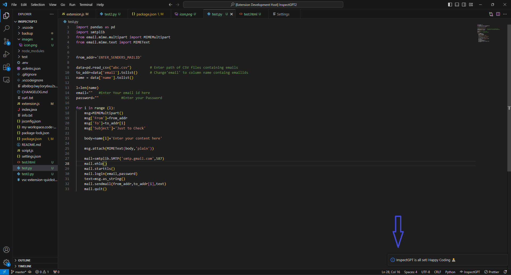
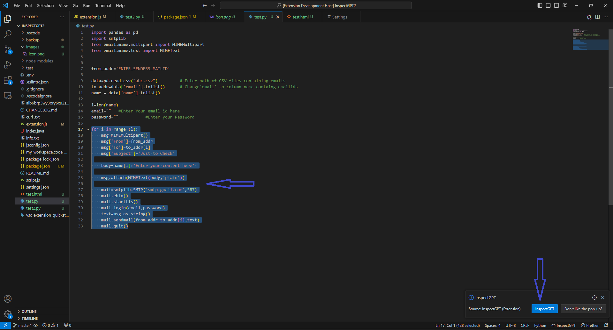
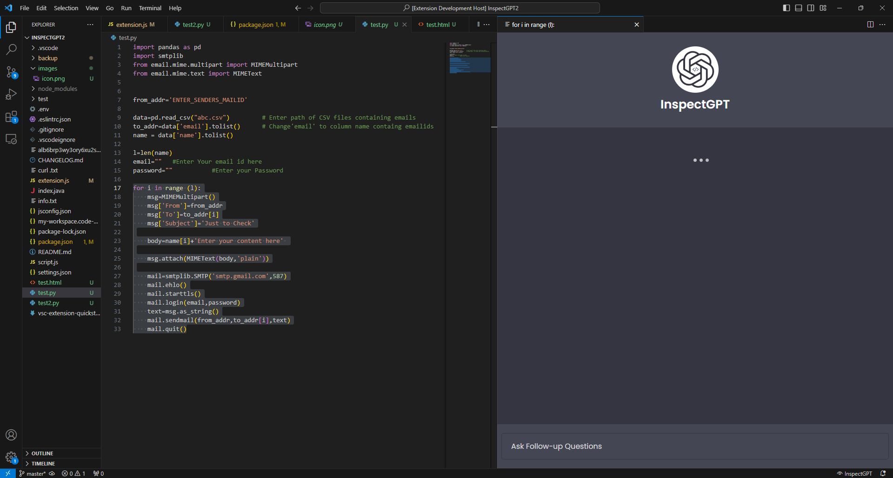
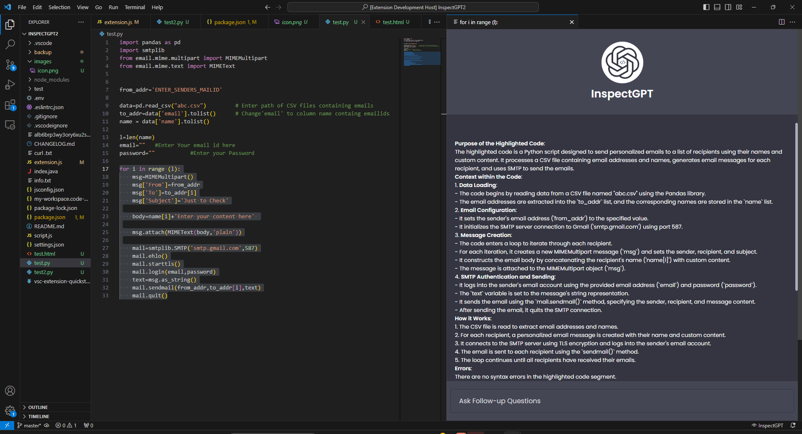
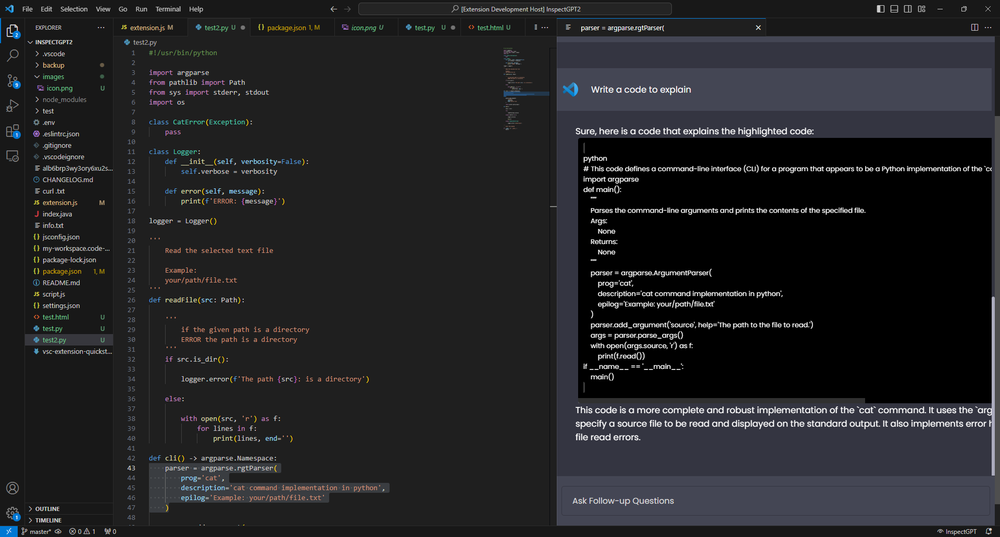
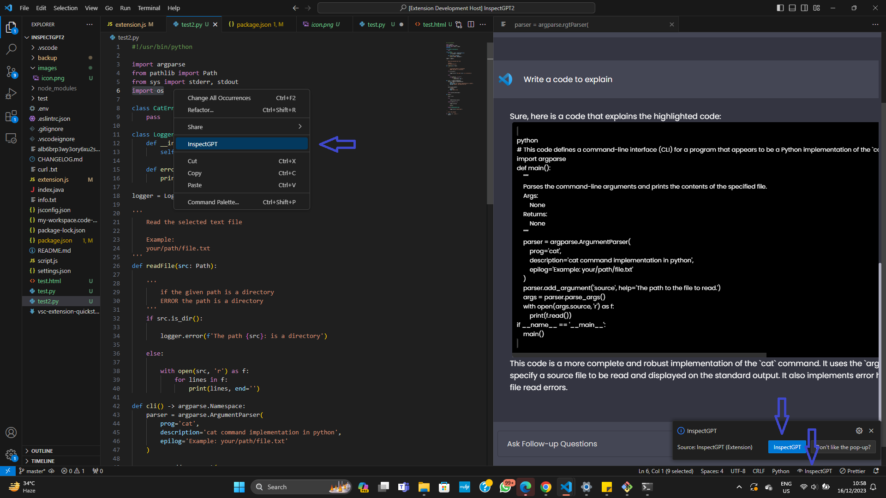

# InspectGPT
### Your AI code Inspector and Assistant.

## Features

- InspectGPT **explains** your highlighted code segment based on the context of your whole coding project.
- InspectGPT **correct** errors and **suggests** improvements to your code.
- InspectGPT allows **followup** questions and gives comprehensive response.
- Many more...

## Features on the way

- Enablement of all programing languages
- Integration of Stackoverflow
- Access to official documentations
- Integration of GPT 4.0

---
*When InspectGPT is ready:*

*Highlight a code segment:*

*Wait for the InspectGPT:*

*Here you go!*

*Ask follow-up Questions:*

*3-way entry:*

## Requirements

Does not require API key.

## Extension Settings
This extension contributes the following settings:

* `InspectGPT.deactivate-Popup-Window`: Enable/disable 'InspectGPT' pop-up.

## Known Issues

Works with only *Python* files for now. Anticipate updates.

## Release Notes

### 1.0.1

Initial Release of InspectGPT.

### 3.0.5

 Up To date.

---

If you are interested in getting in touch, send a message to : <https://twitter.com/otsOfNigeria/>

